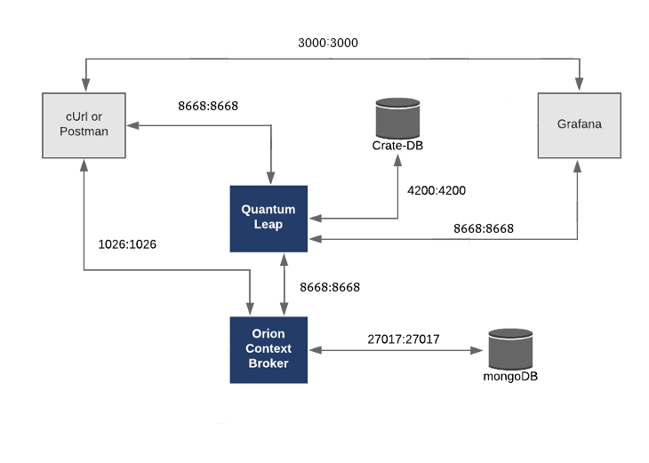

# FIWAREデータ基盤
このアプリケーションは、スプリント1-3で作成したデータ基盤になります。

# アーキテクチャ

このアプリケーションは、[Orion Context Broker](https://fiware-orion.readthedocs.io/en/latest/), [QuantumLeap](https://smartsdk.github.io/ngsi-timeseries-api/)の2つのFIWAREコンポーネントで構成されています。

[Orion Context Broker](https://fiware-orion.readthedocs.io/en/latest/)は、[NGSI-LD](https://forge.etsi.org/swagger/ui/?url=https://forge.etsi.org/rep/NGSI-LD/NGSI-LD/raw/master/spec/updated/generated/full_api.json)リクエストを受けてコンテキスト・エンティティの状態を変更します。FIWARE [QuantumLeap](https://smartsdk.github.io/ngsi-timeseries-api/)はコンテキストの変更をサブスクライブし、CrateDBデータベースにデータを永続化します。

-   [MongoDB](https://www.mongodb.com/) データベース :

    -   **Orion Context Broker** が、データ・エンティティ、サブスクリプション、レジストレーションなどのコンテキスト・
        データ情報を保持するために使用します

-   [CrateDB](https://crate.io/) データベース：

    -   時間ベースの履歴コンテキスト・データを保持するデータシンクとして使用されます
    -   時間ベースのデータクエリを解釈する HTTP エンドポイントを提供します




# 起動

```console
docker compose up -d
```


services スクリプトを実行することによって、すべてのサービスを初期化した状態で起動することができます。
```console
./services orion
```
> 次のコマンドで、すべてのリソースを解放して終了させることができます。
> ```colsole
> ./services stop
> ```

# データの可視化

ブラウザから[http://localhost:3000](http://localhost:3000)にアクセスすることで、[Grafana](https://grafana.com/ja/)によってデータ基盤の情報を参照することができます。
